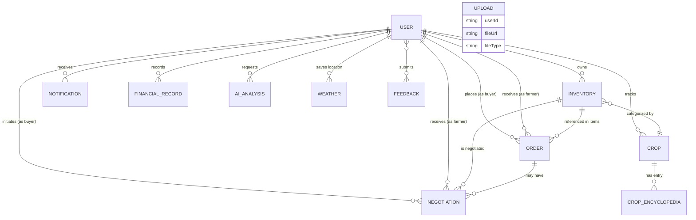

# AgriVision Pro — Database Schema Map

> **Version**: 2.0.0 | **Database**: MongoDB (Mongoose ODM) | **Multi-tenant**: Yes (`tenantId` on every document)

---

## Multi-Tenancy Pattern

Every collection (except `Feedback` and global lookup data) contains a `tenantId: String` field. This enables data isolation per organization on a shared MongoDB cluster. All queries are scoped by `tenantId`.

```
User.find({ tenantId: req.tenantId, role: 'FARMER' })
```

---

## Entity Relationship Diagram



---

## Collections

### 1. `users` — Core Identity

| Field | Type | Notes |
|---|---|---|
| `_id` | ObjectId | Auto-generated |
| `tenantId` | String | Multi-tenancy key, indexed |
| `name` | String | Required, max 100 chars |
| `email` | String | Unique, lowercase |
| `password` | String | bcrypt hashed (12 rounds), `select: false` |
| `role` | Enum | `FARMER \| BUYER \| ADMIN` |
| `farmName` | String | Optional, farmer-specific |
| `farmLocation` | Object | `{ lat, lng, address }` |
| `farmSizeAcres` | Number | Optional |
| `phoneNumber` | String | Optional |
| `avatar` | String | URL to S3 image |
| `isActive` | Boolean | Default `true` |
| `lastLogin` | Date | Updated on each login |
| `selectedCrops` | String[] | Up to 5 crop names for tracking |
| `preferredLanguage` | Enum | `en \| hi \| mr` |
| `state` | String | Indian state |
| `district` | String | |
| `taluka` | String | |
| `village` | String | |
| `pincode` | String | 6-digit regex |
| `aadharNumber` | String | 12-digit regex, sensitive |
| `bankDetails` | Object | `{ accountNumber, ifscCode, bankName }` |
| `createdAt` | Date | Auto timestamp |
| `updatedAt` | Date | Auto timestamp |

**Indexes**: `{ tenantId, email }`, `{ tenantId, role }`

---

### 2. `orders` — B2B Transaction Records

| Field | Type | Notes |
|---|---|---|
| `_id` | ObjectId | |
| `tenantId` | String | Indexed |
| `orderNumber` | String | Auto-generated `AGV-{timestamp}-{random}`, unique |
| `buyerId` | ObjectId → User | Indexed |
| `farmerId` | ObjectId → User | Indexed |
| `items` | OrderItem[] | Array of crop line items |
| `items[].inventoryId` | ObjectId → Inventory | |
| `items[].cropName` | String | |
| `items[].quantity` | Number | |
| `items[].pricePerUnit` | Number | |
| `items[].totalPrice` | Number | |
| `totalAmount` | Number | Sum of all items |
| `currency` | String | Default `USD` |
| `status` | Enum | `pending \| confirmed \| processing \| shipped \| negotiating \| deal_confirmed \| ready_for_pickup \| picked_up \| in_transit \| delivered \| cancelled` |
| `shippingAddress` | Object | `{ street, city, district, taluka, state, pinCode, country }` |
| `paymentStatus` | Enum | `pending \| paid \| failed \| refunded` |
| `paymentMethod` | String | |
| `transactionId` | String | Payment gateway ID, sparse index |
| `messageHistory` | Array | `[{ senderId, senderName, senderRole, message, timestamp }]` |
| `dealConfirmation` | Object | `{ status, buyerConfirmedAt, farmerConfirmedAt, buyerNotes, farmerNotes }` |
| `dealConfirmation.status` | Enum | `pending \| buyer_confirmed \| farmer_confirmed \| both_confirmed` |
| `negotiationId` | ObjectId → Negotiation | Optional ref |
| `agreedPricePerUnit` | Number | Post-negotiation price |
| `agreedQuantity` | Number | |
| `procurement` | Object | `{ arrangedBy, transporterName, transporterContact, vehicleNumber, pickupScheduledAt, actualPickupAt }` |
| `verification` | Object | `{ requestedQuantity, actualQuantity, quantityUnit, verifiedAt, verifiedBy, verificationNotes, qualityGrade, qualityCheckPassed }` |
| `delivery` | Object | `{ estimatedDeliveryDate, actualDeliveryDate, deliveryNotes, proofOfDelivery[] }` |

**Indexes**: `{ tenantId, farmerId, status }`, `{ tenantId, buyerId, status }`, `{ tenantId, createdAt: -1 }`

---

### 3. `inventories` — Farmer's Crop Listings

| Field | Type | Notes |
|---|---|---|
| `tenantId` | String | |
| `farmerId` | ObjectId → User | |
| `cropId` | ObjectId → Crop | Optional |
| `cropName` | String | Required |
| `variety` | String | Default `Standard` |
| `description` | String | max 2000 |
| `quantity` | Number | |
| `unit` | Enum | `ton \| kg \| lb \| bushel \| crate \| box \| quintal` |
| `pricePerUnit` | Number | |
| `currency` | String | |
| `status` | Enum | `available \| low_stock \| out_of_stock \| reserved` — **auto-updated** on quantity change |
| `minimumOrderQuantity` | Number | |
| `availableFrom` | Date | |
| `expiryDate` | Date | Optional |
| `harvestDate` | Date | Optional |
| `certifications` | String[] | e.g. `['Organic', 'Non-GMO']` |
| `images` | String[] | S3 URLs |
| `location` | Object | `{ address, city, district, taluka, state, country, pin, coordinates: { lat, lng } }` |
| `isFeatured` | Boolean | |
| `totalOrders` | Number | Denormalized counter |
| `rating` | Number | 0–5 |
| `reviewCount` | Number | |

**Text Index**: `{ cropName, variety, description, location.city }` for marketplace search
**Indexes**: `{ tenantId, status, isActive }`, `{ isFeatured, isActive }`

---

### 4. `negotiations` — Price Negotiation Threads

| Field | Type | Notes |
|---|---|---|
| `tenantId` | String | |
| `orderId` | ObjectId → Order | |
| `inventoryId` | ObjectId → Inventory | Required |
| `buyerId` | ObjectId → User | |
| `farmerId` | ObjectId → User | |
| `originalPricePerUnit` | Number | Listing price at time of negotiation |
| `originalQuantity` | Number | |
| `proposedPricePerUnit` | Number | Buyer's opening offer |
| `proposedQuantity` | Number | |
| `proposedBy` | Enum | `buyer \| farmer` |
| `counterPricePerUnit` | Number | Optional counter |
| `counterQuantity` | Number | |
| `counterBy` | Enum | `buyer \| farmer` |
| `messages` | Array | `[{ senderId, senderRole, message, proposedPrice?, proposedQuantity?, timestamp }]` |
| `status` | Enum | `pending \| accepted \| rejected \| countered \| expired` |
| `expiresAt` | Date | TTL auto-expire after 7 days |
| `agreedPricePerUnit` | Number | Set on acceptance |
| `agreedQuantity` | Number | |
| `agreedAt` | Date | |

**TTL Index**: `{ expiresAt: 1 }` (expireAfterSeconds: 0)

---

### 5. `notifications`

| Field | Type | Notes |
|---|---|---|
| `tenantId` | String | |
| `userId` | ObjectId → User | Indexed |
| `type` | Enum | `ORDER_STATUS_UPDATE \| LOW_STOCK \| NEW_ORDER \| AI_ANALYSIS_COMPLETE \| SYSTEM` |
| `message` | String | |
| `isRead` | Boolean | Default `false` |
| `orderId` | ObjectId → Order | Optional |
| `inventoryId` | ObjectId → Inventory | Optional |

---

### 6. `crops` — Farmer's Personal Crop Records

Tracks crop planting, growth, and yield for a specific farmer's field.

| Key Fields | Notes |
|---|---|
| `farmerId` | ObjectId → User |
| `cropType` | String |
| `plantingDate` | Date |
| `harvestDate` | Date |
| `fieldLocation` | Object |
| `quantity` | Number |
| `aiAnalyses` | ObjectId[] → AIAnalysis |

---

### 7. `cropencyclopedias` — Knowledge Base

A large document store (~45KB controller) with structured crop knowledge.

| Key Fields | Notes |
|---|---|
| `cropName` | String, indexed |
| `scientificName` | String |
| `category` | String |
| `growingSeason` | String |
| `soilRequirements` | Object |
| `irrigationNeeds` | String |
| `fertilizerRecommendations` | Object |
| `pestDiseases` | Array |
| `marketInfo` | Object |

---

### 8. `aianalyses` — AI Processing Results

| Key Fields | Notes |
|---|---|
| `userId` | ObjectId → User |
| `cropId` | ObjectId → Crop |
| `imageUrl` | String (S3) |
| `analysisType` | Enum |
| `results` | Object — AI model response |
| `confidence` | Number |
| `status` | Enum `pending \| processing \| completed \| failed` |

---

### 9. `financialrecords` — Farm Financial Ledger

| Key Fields | Notes |
|---|---|
| `farmerId` | ObjectId → User |
| `type` | Enum `income \| expense` |
| `amount` | Number (high-precision) |
| `category` | String |
| `date` | Date |
| `orderId` | ObjectId → Order, optional |
| `description` | String |

---

### 10. `marketprices` — Mandi/Market Price Cache

| Key Fields | Notes |
|---|---|
| `commodity` | String |
| `market` | String |
| `state` | String |
| `district` | String |
| `price` | Number (modal/min/max) |
| `date` | Date |
| `source` | String (gov API) |

> Prices are fetched from the government Agmarket API and cached in-memory for 10 minutes.

---

### 11. `weatherdata` — Location-based Weather Cache

| Key Fields | Notes |
|---|---|
| `userId` | ObjectId → User |
| `lat` | Number |
| `lng` | Number |
| `forecast` | Object — OpenWeather API response |
| `fetchedAt` | Date — used for cache invalidation |

---

### 12. `feedback`

| Field | Type | Notes |
|---|---|---|
| `userId` | ObjectId → User | Optional (anonymous allowed) |
| `name` | String | |
| `email` | String | |
| `subject` | String | |
| `message` | String | |
| `rating` | Number | 1–5 |
| `category` | Enum | `bug \| feature \| general \| other` |

---

### 13. `uploads` — File Metadata

| Field | Type | Notes |
|---|---|---|
| `userId` | ObjectId → User | |
| `fileUrl` | String | S3 public URL |
| `fileKey` | String | S3 object key |
| `fileType` | String | MIME type |
| `fileSize` | Number | Bytes |
| `purpose` | String | e.g. `avatar`, `crop-image`, `proof-of-delivery` |

---

## Authentication Flow

```
POST /api/auth/register
  → Hash password (bcrypt, 12 rounds)
  → Create User { tenantId, role: 'FARMER'|'BUYER' }
  → Sign JWT { id, tenantId, role, exp: 7d }
  → Return { token, user }

POST /api/auth/login
  → Find user by email (select +password)
  → comparePassword()
  → Update lastLogin
  → Sign JWT
  → Return { token, user }
```

---

## Role-Based Access Control

| Role | Access |
|---|---|
| `FARMER` | Dashboard, Inventory, Crops, Orders, Negotiations, Chat, Financial, Weather, Market Prices, Encyclopedia |
| `BUYER` | Dashboard, Marketplace, Orders, Negotiations, Chat, Market Prices, Encyclopedia |
| `ADMIN` | All of the above + **Admin Panel** (`/api/admin/*`) |

---

## Index Strategy Summary

| Collection | Key Indexes |
|---|---|
| `users` | `{ tenantId, email }`, `{ tenantId, role }` |
| `orders` | `{ tenantId, farmerId, status }`, `{ tenantId, buyerId, status }`, `{ tenantId, createdAt: -1 }` |
| `inventories` | text search on `cropName/variety/description/city`, `{ tenantId, status, isActive }` |
| `negotiations` | `{ tenantId, buyerId, status }`, `{ tenantId, farmerId, status }`, TTL on `expiresAt` |
| `notifications` | `{ userId }` |

---

## Data Flow: Order Lifecycle

```
Buyer browses Inventory
  → Buyer places Order (status: pending)
  → Farmer receives notification
  → [Optional] Negotiation thread created
  → Negotiation accepted → Order status: deal_confirmed
  → Procurement arranged (transport details)
  → Pickup scheduled → status: ready_for_pickup
  → Goods picked up → status: picked_up
  → In transit → status: in_transit
  → Delivered + proof of delivery → status: delivered
  → Payment marked as paid
  → Financial record created for farmer
```
